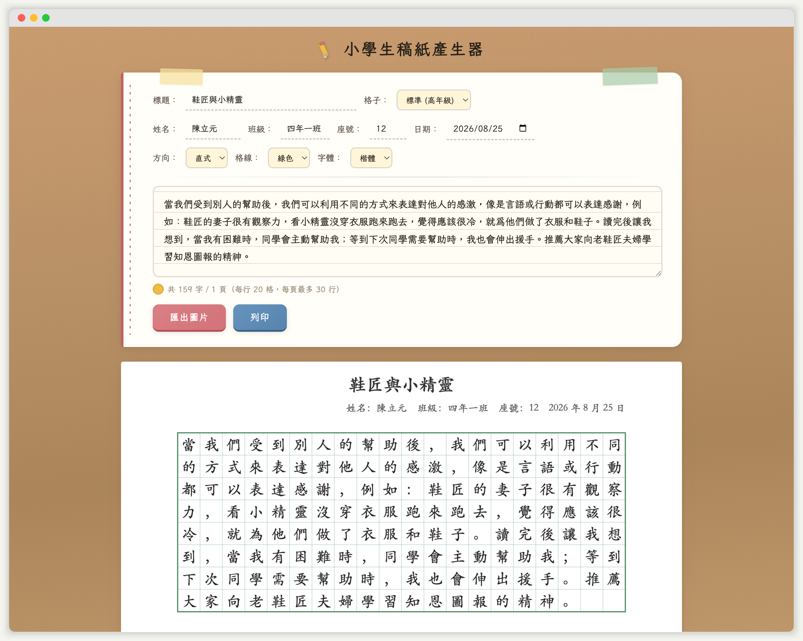

# 小學生稿紙產生器

貼上文字，自動排進中文作文稿紙，匯出 PNG 或直接列印。

## 功能

- A4 直式 / 橫式切換
- 格子大小：大格（低年級 12 格）、中格（中年級 15 格）、標準（高年級 20 格）
- 行數自動適配內容（不浪費空白）
- 姓名、班級、座號、日期欄位
- 格線顏色：綠 / 紅 / 灰 / 藍
- 字體：宋體 / 楷體
- 標題欄位（選填）
- 匯出 PNG 圖檔
- 瀏覽器直接列印
- 超過單頁自動分頁
- 標點禁則處理（句號逗號不會出現在行首）
- 所有設定自動記憶（localStorage）
- 手機版可用

## 使用方式

單檔 HTML，不需安裝任何東西：

1. 開啟 https://john8895.github.io/manuscript-paper-generator/
2. 貼上文字
3. 按「匯出圖片」或「列印」

也可以下載 `index.html` 離線使用。

## License

MIT
